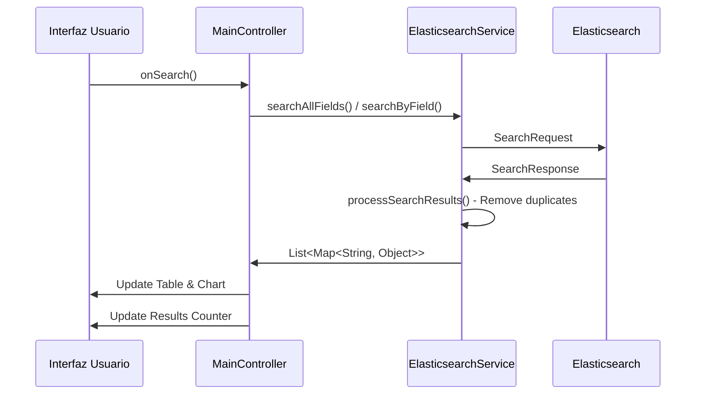

# 📊 Java Elasticsearch Dashboard

Un proyecto completo que demuestra la integración entre **Java**, **Elasticsearch** y **JavaFX** para crear un sistema de indexación y visualización de datos desde archivos Excel.

## 🎯 Descripción del Proyecto

Este proyecto implementa un pipeline completo de **ETL (Extract, Transform, Load)** que:

1. **Extrae** datos de archivos Excel (.xlsx)
2. **Transforma** los datos en documentos JSON
3. **Carga** los datos en Elasticsearch para indexación
4. **Visualiza** los datos a través de una interfaz JavaFX con tablas y gráficos interactivos

## 🏗️ Arquitectura del Sistema

```
┌─────────────────┐    ┌─────────────────┐    ┌─────────────────┐    ┌─────────────────┐
│   Excel Files   │───▶│  Apache POI     │───▶│  Elasticsearch  │───▶│   JavaFX UI     │
│    (.xlsx)      │    │  (ExcelReader)  │    │   (Indexing)    │    │ (Visualization) │
└─────────────────┘    └─────────────────┘    └─────────────────┘    └─────────────────┘
```

## 🚀 Tecnologías Utilizadas

### Core Technologies
- **Java 21**: Lenguaje de programación principal
- **JavaFX 21.0.1**: Framework para la interfaz gráfica
- **Maven**: Gestión de dependencias y construcción del proyecto

### Elasticsearch Stack
- **Elasticsearch 8.11.0**: Motor de búsqueda y análisis
- **Elasticsearch Java Client**: Cliente oficial para Java
- **Docker**: Contenedorización de Elasticsearch

### Procesamiento de Datos
- **Apache POI 5.3.0**: Lectura de archivos Excel
- **Jackson 2.15.2**: Serialización/deserialización JSON

## 🐳 Configuración de Elasticsearch con Docker

### Imagen de Docker Utilizada

```bash
# Descargar la imagen oficial de Elasticsearch desde Docker Hub
docker pull docker.elastic.co/elasticsearch/elasticsearch:8.19.4

# Ejecutar Elasticsearch en modo de desarrollo
docker run -d \
  --name elasticsearch \
  -p 9200:9200 \
  -p 9300:9300 \
  -e "discovery.type=single-node" \
  -e "xpack.security.enabled=false" \
  docker.elastic.co/elasticsearch/elasticsearch:8.19.4
```

### Verificación de la Conexión

```bash
# Verificar que Elasticsearch está ejecutándose
curl -X GET "localhost:9200/"
```

Respuesta esperada:
```json
{
  "name" : "docker-cluster",
  "cluster_name" : "docker-cluster",
  "cluster_uuid" : "...",
  "version" : {
    "number" : "8.19.4",
    "lucene_version" : "9.12.2"
  }
}
```

## 🔧 Conexión a Elasticsearch

### Código de Conexión

```java
public class ElasticConnection {
    private ElasticsearchClient client;
    private ElasticsearchTransport transport;
    private RestClient restClient;

    public ElasticsearchClient connect() throws IOException {
        if (client == null) {
            // Crear el cliente REST de bajo nivel
            restClient = RestClient.builder(
                    new HttpHost("localhost", 9200, "http")
            ).build();

            // Crear el transporte con el mapper JSON
            transport = new RestClientTransport(
                    restClient, new JacksonJsonpMapper()
            );

            // Crear el cliente de Elasticsearch
            client = new ElasticsearchClient(transport);
        }
        return client;
    }
}
```

### Características de la Conexión

- **Host**: `localhost:9200` (configuración por defecto)
- **Protocolo**: HTTP (sin SSL para desarrollo)
- **Transport**: RestClientTransport con Jackson JSON mapper
- **Pool de Conexiones**: Manejo automático por el RestClient

## 📋 Requisitos

1. **Java 21 o superior** (necesario para JavaFX 21 en ARM64)
2. **Elasticsearch ejecutándose localmente:**
   ```bash
   # Usando Docker (recomendado)
   docker run -d --name elasticsearch \
     -p 9200:9200 \
     -e "discovery.type=single-node" \
     -e "xpack.security.enabled=false" \
     docker.elastic.co/elasticsearch/elasticsearch:8.11.0
   ```

## 🚀 Uso

### Compilar y ejecutar:
```bash
mvn clean compile
mvn javafx:run
```

### Prueba rápida sin interfaz gráfica:
```bash
mvn exec:java -Dexec.mainClass="com.una.ale.util.ElasticsearchTest"
```

### Uso programático:
```java
ElasticsearchService service = new ElasticsearchService();
try {
    boolean connected = service.testConnection();
    if (connected) {
        String info = service.getClusterInfo();
        System.out.println(info);
    }
} finally {
    service.close();
}
```


## 🔧 Características

- 🔗 Conexión automática a Elasticsearch
- 🖥️ Interfaz gráfica JavaFX intuitiva
- 📊 Información del cluster en tiempo real
- 🔒 Manejo seguro de recursos y conexiones
- 🧪 Clase de prueba independiente
- 📱 Compatible con Mac ARM64 (M1/M2/M3)

## ⚠️ Notas Importantes

- El proyecto usa JavaFX 21 para compatibilidad ARM64
- La conexión se configura para localhost:9200 sin autenticación
- Recuerda siempre cerrar las conexiones para liberar recursos
- Para producción, considera configurar autenticación y SSL


## 🚀 Instalación y Ejecución

### Prerrequisitos
```bash
# Java 21
java --version

# Maven
mvn --version

# Docker (para Elasticsearch)
docker --version
```

### Pasos de Instalación

1. **Clonar el repositorio**:
```bash
git clone <repository-url>
cd elastic
```

2. **Iniciar Elasticsearch**:
```bash
docker run -d \
  --name elasticsearch \
  -p 9200:9200 \
  -e "discovery.type=single-node" \
  -e "xpack.security.enabled=false" \
  docker.elastic.co/elasticsearch/elasticsearch:8.19.4
```

3. **Compilar el proyecto**:
```bash
mvn clean compile
```

4. **Ejecutar la aplicación**:
```bash
mvn javafx:run
```

### Verificación de Funcionamiento

1. **Conexión a Elasticsearch**: El status debe mostrar "Conectado a Elasticsearch"
2. **Carga de Datos**: La tabla debe poblarse con datos del Excel
3. **Visualización**: El gráfico debe mostrar barras con datos agrupados

## 📁 Estructura Completa del Proyecto

```
src/
├── main/
│   ├── java/
│   │   └── com/una/ale/
│   │       ├── App.java                    # Clase principal
│   │       ├── controllers/
│   │       │   └── MainController.java     # Controlador JavaFX
│   │       ├── models/                     # Modelos de datos
│   │       ├── services/
│   │       │   └── ElasticsearchService.java # Servicios de ES
│   │       └── util/
│   │           ├── ElasticConnection.java   # Conexión a ES
│   │           └── ExcelReader.java        # Lector de Excel
│   └── resources/
│       └── com/una/ale/
│           ├── resources/
│           │   └── excel/
│           │       └── ventas.xlsx         # Datos de ejemplo
│           └── view/
│               └── main.fxml               # Interfaz JavaFX
```

## ⚙️ Configuración

### Elasticsearch
- **Host**: localhost
- **Puerto**: 9200
- **Índice por defecto**: `excel_ventas`

### JavaFX
- **Resolución**: 1200x800 pixels
- **Tema**: Diseño moderno con CSS integrado

### Archivos Excel
- **Ubicación**: `src/main/resources/com/una/ale/resources/excel/`
- **Formato**: .xlsx (Excel 2007+)
- **Estructura esperada**: id, fecha, cliente, producto, cantidad, precio_unitario, total, provincia

## 📄 Proceso de Indexación

### 1. Lectura del Excel

```java
public class ExcelReader {
    public Map<Integer, List<String>> readExcel(String filePath) throws IOException {
        Map<Integer, List<String>> data = new HashMap<>();
        
        try (FileInputStream file = new FileInputStream(filePath);
             XSSFWorkbook workbook = new XSSFWorkbook(file)) {
            
            XSSFSheet sheet = workbook.getSheetAt(0);
            
            for (int i = 0; i <= sheet.getLastRowNum(); i++) {
                Row row = sheet.getRow(i);
                List<String> rowData = new ArrayList<>();
                
                if (row != null) {
                    for (int j = 0; j < row.getLastCellNum(); j++) {
                        Cell cell = row.getCell(j);
                        rowData.add(getCellValueAsString(cell));
                    }
                }
                data.put(i, rowData);
            }
        }
        return data;
    }
}
```

### 2. Transformación de Datos

Los datos del Excel se transforman en documentos JSON:

```java
private Map<String, Object> createDocument(List<String> headers, List<String> row) {
    Map<String, Object> document = new HashMap<>();
    
    for (int i = 0; i < headers.size() && i < row.size(); i++) {
        String header = headers.get(i);
        String value = row.get(i);
        
        // Conversión de tipos específicos
        if ("total".equals(header) || "precio_unitario".equals(header)) {
            document.put(header, parseDouble(value));
        } else if ("cantidad".equals(header)) {
            document.put(header, parseInt(value));
        } else {
            document.put(header, value);
        }
    }
    
    return document;
}
```

### 3. Indexación Masiva (Bulk API)

```java
public int bulkIndexDocuments(String indexName, List<Map<String, Object>> documents) throws IOException {
    BulkRequest.Builder bulkBuilder = new BulkRequest.Builder();
    
    for (Map<String, Object> document : documents) {
        bulkBuilder.operations(op -> op
            .index(idx -> idx
                .index(indexName)
                .document(document)
            )
        );
    }
    
    BulkResponse bulkResponse = client.bulk(bulkBuilder.build());
    
    if (bulkResponse.errors()) {
        // Manejo de errores...
    }
    
    return documents.size() - (int) bulkResponse.items().stream()
        .filter(item -> item.error() != null)
        .count();
}
```

## 🔍 Sistema de Búsqueda en Elasticsearch

### ¿Cómo Funciona la Búsqueda?

La aplicación implementa un sistema de búsqueda completo que permite buscar en todos los campos o en campos específicos:

#### 1. **Búsqueda Global (Todos los campos)**
```java
public List<Map<String, Object>> searchAllFields(String indexName, String searchText) throws IOException {
    SearchRequest searchRequest = SearchRequest.of(s -> s
        .index(indexName)
        .query(q -> q
            .queryString(qs -> qs
                .query(searchText)
                .defaultField("*")  // Buscar en todos los campos
                .analyzer("standard")
            )
        )
        .size(100)
    );
    
    SearchResponse<ObjectNode> response = client.search(searchRequest, ObjectNode.class);
    return processSearchResults(response);
}
```

**¿Qué hace internamente?**
- Usa el analizador `standard` que tokeniza el texto por espacios y puntuación
- Busca en todos los campos del documento (`defaultField: "*"`)
- Elasticsearch calcula automáticamente la relevancia usando TF-IDF
- Los resultados se ordenan por score de relevancia

#### 2. **Búsqueda por Campo Específico**
```java
public List<Map<String, Object>> searchByField(String indexName, String fieldName, String searchText) throws IOException {
    SearchRequest searchRequest = SearchRequest.of(s -> s
        .index(indexName)
        .query(q -> q
            .match(m -> m
                .field(fieldName)
                .query(searchText)
                .fuzziness("AUTO")  // Tolerancia a errores tipográficos
            )
        )
        .size(100)
    );
    
    SearchResponse<ObjectNode> response = client.search(searchRequest, ObjectNode.class);
    return processSearchResults(response);
}
```

**Características avanzadas:**
- **Fuzziness "AUTO"**: Tolera 1-2 errores tipográficos automáticamente
- **Match Query**: Busca coincidencias exactas o parciales en el campo específico
- **Análisis de texto**: Aplica stemming y normalización según el idioma

#### 3. **Prevención de Duplicados**
```java
private List<Map<String, Object>> processSearchResults(SearchResponse<ObjectNode> response) {
    Map<String, Map<String, Object>> uniqueDocuments = new LinkedHashMap<>();
    
    for (Hit<ObjectNode> hit : response.hits().hits()) {
        Map<String, Object> sourceMap = objectMapper.convertValue(hit.source(), Map.class);
        String docId = sourceMap.get("id").toString();
        
        // Solo agregar si no existe (evita duplicados)
        if (!uniqueDocuments.containsKey(docId)) {
            uniqueDocuments.put(docId, sourceMap);
        }
    }
    
    return new ArrayList<>(uniqueDocuments.values());
}
```

### Tipos de Consultas Implementadas

| Tipo de Consulta | Uso | Ejemplo | Tolerancia a Errores |
|---|---|---|---|
| **Query String** | Búsqueda global | `Pedro ventas` | Media |
| **Match Query** | Campo específico | `cliente: "Pedro"` | Alta (Fuzziness) |
| **Term Query** | Coincidencia exacta | `provincia: "San José"` | Ninguna |

### Interfaz de Usuario para Búsqueda

#### Componentes JavaFX
```java
@FXML private TextField txtSearch;           // Campo de búsqueda
@FXML private ComboBox<String> cmbSearchField; // Selector de campo
@FXML private Button btnSearch;              // Botón buscar
@FXML private Button btnClearSearch;         // Limpiar búsqueda
@FXML private Label lblSearchResults;        // Contador de resultados
```

#### Funcionalidades Implementadas
1. **Búsqueda en tiempo real**: Al presionar Enter
2. **Selector de campo**: Dropdown con opciones disponibles
3. **Contador de resultados**: Muestra cantidad de documentos encontrados
4. **Limpieza de búsqueda**: Restaura vista completa de datos
5. **Sincronización**: Tabla y gráfico se actualizan automáticamente

### Flujo de Búsqueda Completo



## 🔍 Proceso de Indexación en Elasticsearch

### ¿Qué hace Elasticsearch al indexar?

#### 1. **Análisis del Documento**
Cuando Elasticsearch recibe un documento JSON:
```json
{
  "id": 1,
  "fecha": "01/15/2024",
  "cliente": "Pedro García",
  "producto": "Laptop HP",
  "cantidad": 2,
  "precio_unitario": 850000.0,
  "total": 1700000.0,
  "provincia": "San José"
}
```

**Elasticsearch automáticamente:**
- **Detecta tipos de datos**: Numbers, texto, fechas
- **Aplica analizadores**: Para campos de texto (tokenización, stemming)
- **Crea mapping dinámico**: Define estructura del índice

#### 2. **Creación del Mapping Automático**
```json
{
  "mappings": {
    "properties": {
      "id": { 
        "type": "long" 
      },
      "fecha": { 
        "type": "text",
        "fields": {
          "keyword": { "type": "keyword", "ignore_above": 256 }
        }
      },
      "cliente": { 
        "type": "text",
        "analyzer": "standard",
        "fields": {
          "keyword": { "type": "keyword", "ignore_above": 256 }
        }
      },
      "producto": { 
        "type": "text",
        "analyzer": "standard" 
      },
      "cantidad": { 
        "type": "long" 
      },
      "precio_unitario": { 
        "type": "double" 
      },
      "total": { 
        "type": "double" 
      },
      "provincia": { 
        "type": "text",
        "fields": {
          "keyword": { "type": "keyword" }
        }
      }
    }
  }
}
```

#### 3. **Proceso de Análisis de Texto**

Para el campo `cliente: "Pedro García"`:

```
1. Tokenización:     ["Pedro", "García"]
2. Lowercase:        ["pedro", "garcía"]  
3. Normalización:    ["pedro", "garcia"]  # Removal de acentos
4. Stemming:         ["pedr", "garci"]    # Reducción a raíz
```

Esto permite que búsquedas como `"pedro"`, `"Pedro"`, `"PEDRO"` encuentren el documento.

#### 4. **Almacenamiento y Sharding**

```
┌─────────────────┐    ┌─────────────────┐    ┌─────────────────┐
│     Shard 0     │    │     Shard 1     │    │     Shard 2     │
│  Docs 1,4,7...  │    │  Docs 2,5,8...  │    │  Docs 3,6,9...  │
└─────────────────┘    └─────────────────┘    └─────────────────┘
         │                       │                       │
         ▼                       ▼                       ▼
┌─────────────────┐    ┌─────────────────┐    ┌─────────────────┐
│   Replica 0-1   │    │   Replica 1-1   │    │   Replica 2-1   │
│  (Backup copy)  │    │  (Backup copy)  │    │  (Backup copy)  │
└─────────────────┘    └─────────────────┘    └─────────────────┘
```

#### 5. **Creación de Índices Invertidos**

Para búsquedas rápidas, Elasticsearch crea índices invertidos:

```
Término → Lista de Documentos
"pedro"  → [1, 5, 12, 23]
"garcia" → [1, 8, 15]  
"laptop" → [1, 3, 7, 11]
"hp"     → [1, 9, 14]
```

### Implementación en Java

#### 1. **Indexación Individual**
```java
public boolean indexDocument(String indexName, Map<String, Object> document) throws IOException {
    IndexRequest request = IndexRequest.of(i -> i
        .index(indexName)
        .document(document)
    );
    
    IndexResponse response = client.index(request);
    return response.result() == Result.Created || response.result() == Result.Updated;
}
```

#### 2. **Indexación Masiva (Bulk API)**
```java
public int bulkIndexDocuments(String indexName, List<Map<String, Object>> documents) throws IOException {
    BulkRequest.Builder bulkBuilder = new BulkRequest.Builder();
    
    // Agregar operaciones de indexación en lote
    for (Map<String, Object> document : documents) {
        bulkBuilder.operations(op -> op
            .index(idx -> idx
                .index(indexName)
                .document(document)
            )
        );
    }
    
    BulkResponse bulkResponse = client.bulk(bulkBuilder.build());
    
    // Contar documentos exitosos
    int successCount = 0;
    for (BulkResponseItem item : bulkResponse.items()) {
        if (item.error() == null) {
            successCount++;
        } else {
            System.err.println("Error indexando documento: " + item.error().reason());
        }
    }
    
    return successCount;
}
```

#### 3. **Ventajas de la Indexación Masiva**

| Característica | Indexación Individual | Bulk API |
|---|---|---|
| **Performance** | 1 doc/request | 100+ docs/request |
| **Overhead de Red** | Alto | Bajo |
| **Througput** | ~100 docs/sec | ~10,000 docs/sec |
| **Uso de Memoria** | Bajo | Moderado |
| **Recomendado para** | Docs únicos en tiempo real | Carga inicial masiva |

### Optimizaciones de Indexación

#### 1. **Configuración de Índice**
```java
public void createIndexWithSettings(String indexName) throws IOException {
    CreateIndexRequest request = CreateIndexRequest.of(c -> c
        .index(indexName)
        .settings(s -> s
            .numberOfShards("1")           // Para datasets pequeños
            .numberOfReplicas("0")         // Sin réplicas en desarrollo
            .refreshInterval("30s")        // Refresh menos frecuente
        )
    );
    
    client.indices().create(request);
}
```

#### 2. **Batch Processing**
```java
public int indexExcelData(String indexName, Map<Integer, List<String>> excelData, List<String> headers) {
    List<Map<String, Object>> batch = new ArrayList<>();
    final int BATCH_SIZE = 100;
    int totalIndexed = 0;
    
    for (int i = 1; i < excelData.size(); i++) { // Skip header row
        Map<String, Object> document = createDocument(headers, excelData.get(i));
        batch.add(document);
        
        // Procesar en lotes
        if (batch.size() >= BATCH_SIZE) {
            totalIndexed += bulkIndexDocuments(indexName, batch);
            batch.clear();
        }
    }
    
    // Procesar lote final
    if (!batch.isEmpty()) {
        totalIndexed += bulkIndexDocuments(indexName, batch);
    }
    
    return totalIndexed;
}
```

### Verificación y Monitoreo

#### Comandos curl para verificar indexación:
```bash
# Verificar el mapping del índice
curl -X GET "localhost:9200/excel_ventas/_mapping"

# Ver estadísticas del índice
curl -X GET "localhost:9200/excel_ventas/_stats"

# Contar documentos
curl -X GET "localhost:9200/excel_ventas/_count"

# Ver configuración del índice
curl -X GET "localhost:9200/excel_ventas/_settings"

# Buscar todos los documentos
curl -X GET "localhost:9200/excel_ventas/_search?pretty"
```

#### En la aplicación Java:
```java
// Verificar estado del índice
public Map<String, Object> getIndexStats(String indexName) throws IOException {
    IndicesStatsRequest request = IndicesStatsRequest.of(i -> i.index(indexName));
    IndicesStatsResponse response = client.indices().stats(request);
    
    return Map.of(
        "documentCount", response.indices().get(indexName).total().docs().count(),
        "indexSize", response.indices().get(indexName).total().store().sizeInBytes(),
        "shards", response.indices().get(indexName).shards().size()
    );
}
```

### Búsquedas Avanzadas Disponibles

#### 1. **Búsqueda con Agregaciones**
```java
public Map<String, Long> getProductStats(String indexName) throws IOException {
    SearchRequest searchRequest = SearchRequest.of(s -> s
        .index(indexName)
        .size(0)  // Solo queremos agregaciones, no documentos
        .aggregations("product_sales", a -> a
            .terms(t -> t
                .field("producto.keyword")
                .size(10)
            )
            .aggregations("total_sales", sub -> sub
                .sum(sum -> sum.field("total"))
            )
        )
    );
    
    SearchResponse<Void> response = client.search(searchRequest, Void.class);
    // Procesar agregaciones...
}
```

#### 2. **Búsqueda con Filtros de Rango**
```java
public List<Map<String, Object>> searchByDateRange(String indexName, String startDate, String endDate) throws IOException {
    SearchRequest searchRequest = SearchRequest.of(s -> s
        .index(indexName)
        .query(q -> q
            .range(r -> r
                .field("fecha")
                .gte(JsonData.of(startDate))
                .lte(JsonData.of(endDate))
            )
        )
    );
    
    SearchResponse<ObjectNode> response = client.search(searchRequest, ObjectNode.class);
    return processSearchResults(response);
}
```

#### 3. **Búsqueda Combinada (Bool Query)**
```java
public List<Map<String, Object>> complexSearch(String indexName, String producto, double minTotal) throws IOException {
    SearchRequest searchRequest = SearchRequest.of(s -> s
        .index(indexName)
        .query(q -> q
            .bool(b -> b
                .must(m -> m.match(match -> match.field("producto").query(producto)))
                .filter(f -> f.range(r -> r.field("total").gte(JsonData.of(minTotal))))
                .should(should -> should.term(t -> t.field("provincia.keyword").value("San José")))
            )
        )
    );
    
    SearchResponse<ObjectNode> response = client.search(searchRequest, ObjectNode.class);
    return processSearchResults(response);
}
```

### Mejores Prácticas de Búsqueda

#### 1. **Uso de Keywords vs Text**
```java
// ❌ Búsqueda en campo text (tokenizado)
.term(t -> t.field("provincia").value("San José"))  // No encuentra nada

// ✅ Búsqueda en campo keyword (exacto)
.term(t -> t.field("provincia.keyword").value("San José"))  // Encuentra exacto

// ✅ Búsqueda fuzzy en campo text
.match(m -> m.field("provincia").query("San José").fuzziness("AUTO"))  // Flexible
```

#### 2. **Manejo de Errores de Búsqueda**
```java
public List<Map<String, Object>> safeSearch(String indexName, String searchText) {
    try {
        return searchAllFields(indexName, searchText);
    } catch (ElasticsearchException e) {
        if (e.status() == 404) {
            System.out.println("Índice no encontrado: " + indexName);
            return new ArrayList<>();
        } else {
            System.err.println("Error de búsqueda: " + e.getMessage());
            throw new RuntimeException("Error en búsqueda", e);
        }
    } catch (IOException e) {
        System.err.println("Error de conexión: " + e.getMessage());
        return new ArrayList<>();
    }
}
```

#### 3. **Optimización de Performance**
```java
public SearchRequest optimizedSearchRequest(String indexName, String query) {
    return SearchRequest.of(s -> s
        .index(indexName)
        .query(q -> q.queryString(qs -> qs.query(query)))
        .source(src -> src.excludes("large_field"))  // Excluir campos grandes
        .size(50)                                     // Limitar resultados
        .timeout("30s")                              // Timeout de búsqueda
        .trackTotalHits(t -> t.enabled(false))       // No contar total si no necesario
    );
}
```

## 🔧 Configuración Avanzada de Elasticsearch

### Settings Personalizados para el Índice

```java
public void createOptimizedIndex(String indexName) throws IOException {
    CreateIndexRequest request = CreateIndexRequest.of(c -> c
        .index(indexName)
        .settings(s -> s
            // Configuración de shards
            .numberOfShards("1")                    // Para datasets pequeños
            .numberOfReplicas("0")                  // Sin réplicas en desarrollo
            
            // Configuración de refresh
            .refreshInterval("30s")                 // Menos frecuente para mejor performance
            
            // Configuración de análisis
            .analysis(a -> a
                .analyzer("spanish_analyzer", an -> an
                    .custom(c -> c
                        .tokenizer("standard")
                        .filter("lowercase", "spanish_stop", "spanish_stemmer")
                    )
                )
                .filter("spanish_stop", f -> f
                    .definition(d -> d.stop(st -> st.stopwords("_spanish_")))
                )
                .filter("spanish_stemmer", f -> f
                    .definition(d -> d.stemmer(st -> st.language("spanish")))
                )
            )
        )
        .mappings(m -> m
            .properties("cliente", p -> p
                .text(t -> t
                    .analyzer("spanish_analyzer")
                    .fields("keyword", f -> f.keyword(k -> k.ignoreAbove(256)))
                )
            )
            .properties("producto", p -> p
                .text(t -> t
                    .analyzer("spanish_analyzer")
                    .fields("keyword", f -> f.keyword(k -> k.ignoreAbove(256)))
                )
            )
            .properties("fecha", p -> p
                .date(d -> d.format("MM/dd/yyyy||yyyy-MM-dd||epoch_millis"))
            )
            .properties("total", p -> p
                .double_(d -> d)
            )
        )
    );
    
    client.indices().create(request);
}
```

### Análisis de Performance

#### Métricas Importantes:
```java
public void printPerformanceMetrics(String indexName) throws IOException {
    // Estadísticas del índice
    IndicesStatsResponse statsResponse = client.indices().stats(
        IndicesStatsRequest.of(i -> i.index(indexName))
    );
    
    var indexStats = statsResponse.indices().get(indexName).total();
    
    System.out.println("=== MÉTRICAS DE PERFORMANCE ===");
    System.out.println("Documentos: " + indexStats.docs().count());
    System.out.println("Tamaño del índice: " + formatBytes(indexStats.store().sizeInBytes()));
    System.out.println("Búsquedas totales: " + indexStats.search().queryTotal());
    System.out.println("Tiempo promedio de búsqueda: " + indexStats.search().queryTimeInMillis() + "ms");
    System.out.println("Indexaciones totales: " + indexStats.indexing().indexTotal());
    System.out.println("Tiempo promedio de indexación: " + indexStats.indexing().indexTimeInMillis() + "ms");
}
```

## 📊 Comparación: Java vs Kibana para Visualización

### Ventajas de la Implementación Java + JavaFX

| Aspecto | Java + JavaFX | Kibana |
|---------|---------------|--------|
| **Control Total** | ✅ Lógica personalizada | ❌ Limitado a widgets |
| **Integración** | ✅ Nativa con aplicación | ❌ Herramienta externa |
| **UI/UX Personalizada** | ✅ Diseño completamente libre | ❌ Templates predefinidos |
| **Lógica de Negocio** | ✅ Código Java nativo | ❌ Requiere plugins |
| **Deployment** | ✅ Single JAR application | ❌ Infraestructura adicional |

### Cuándo Usar Cada Enfoque

**✅ Usar Java + JavaFX cuando:**
- Necesitas integración con aplicación Java existente
- Requieres workflows específicos de negocio
- Tienes requisitos de UI muy particulares
- El equipo es principalmente desarrolladores Java
- Necesitas funcionalidades offline

**✅ Usar Kibana cuando:**
- Necesitas dashboards rápidos para análisis exploratorio
- Trabajas con grandes volúmenes de datos (GB/TB)
- Requieres funcionalidades avanzadas (Machine Learning, Alerting)
- El equipo incluye analistas de datos sin experiencia en programación
- Necesitas dashboards compartidos para múltiples usuarios

### Hybrid Approach: Lo Mejor de Ambos Mundos

```java
public class HybridVisualizationService {
    
    // Para aplicación de usuario final
    public void showJavaFXDashboard(List<Map<String, Object>> data) {
        Platform.runLater(() -> {
            // UI personalizada con lógica de negocio
            updateCustomerDashboard(data);
            applyBusinessRules(data);
        });
    }
    
    // Para análisis exploratorio
    public void generateKibanaUrl(String indexName, Map<String, String> filters) {
        String kibanaUrl = "http://localhost:5601/app/discover#/" +
                          "?_g=(filters:!(),time:(from:now-24h,to:now))" +
                          "&_a=(index:'" + indexName + "')";
        
        // Abrir en navegador para análisis detallado
        openInBrowser(kibanaUrl);
    }
}
```

### Panel Principal
- **Tabla de Datos**: Muestra todos los registros indexados
- **Gráfico de Barras**: Visualización interactiva con múltiples agrupaciones
- **Controles de Gráfico**: ComboBox para seleccionar tipo de visualización

### Tipos de Análisis Disponibles
1. **Ventas por Producto**: Top productos más vendidos
2. **Ventas por Provincia**: Distribución geográfica de ventas
3. **Ventas por Cliente**: Clientes más importantes
4. **Ventas por Mes**: Tendencias temporales
5. **Cantidad por Producto**: Volumen de productos vendidos

### Operaciones Disponibles
- **🔄 Reindexar Datos**: Actualizar índice con nuevos datos
- **🔗 Reconectar ES**: Reestablecer conexión con Elasticsearch
- **📊 Cargar Datos**: Refrescar tabla y gráficos
- **📋 Ver en Consola**: Mostrar datos en terminal
- **🖥️ Visualizador Gráfico**: Ventana dedicada de visualización

## 📊 Visualización de Datos con Java

### Interfaz JavaFX vs Kibana

| Característica | JavaFX (Este Proyecto) | Kibana |
|---|---|---|
| **Integración** | Nativa con aplicación Java | Herramienta externa |
| **Personalización** | Control total sobre UI/UX | Templates predefinidos |
| **Complejidad** | Requiere desarrollo | Configuración visual |
| **Flexibilidad** | Alta - código personalizado | Media - widgets limitados |

### Cuándo Usar Cada Uno

**Usar Java + JavaFX cuando**:
- Necesitas integración con aplicación existente
- Requieres lógica de negocio específica
- Tienes requisitos de UI muy particulares
- El equipo es principalmente de desarrollo Java

**Usar Kibana cuando**:
- Necesitas dashboards rápidos para análisis
- Trabajas con grandes volúmenes de datos
- Requieres funcionalidades avanzadas de análisis
- El equipo incluye analistas de datos


### Componentes de Visualización

#### 1. Tabla de Datos
```java
@FXML
private void setupTableColumns() {
    // Configuración dinámica de columnas
    colId.setCellValueFactory(data -> 
        new SimpleStringProperty(data.getValue().get("id").toString()));
    
    colFecha.setCellValueFactory(data -> 
        new SimpleStringProperty(data.getValue().get("fecha").toString()));
    
    // ... más columnas
}
```

#### 2. Gráficos Interactivos
```java
public enum ChartType {
    PRODUCTO("Producto", "producto", "Ventas por Producto"),
    PROVINCIA("Provincia", "provincia", "Ventas por Provincia"), 
    CLIENTE("Cliente", "cliente", "Ventas por Cliente"),
    MES("Mes", "fecha", "Ventas por Mes");
    
    // Configuración dinámica de agrupaciones
}

private void updateChart(List<Map<String, Object>> documents, ChartType chartType) {
    Map<String, Double> groupedData = documents.stream()
        .filter(doc -> doc.get(chartType.getFieldName()) != null)
        .collect(Collectors.groupingBy(
            doc -> doc.get(chartType.getFieldName()).toString(),
            Collectors.summingDouble(doc -> parseDouble(doc.get("total")))
        ));
    
    // Crear series de datos para BarChart
    XYChart.Series<String, Number> series = new XYChart.Series<>();
    series.setName(chartType.getDisplayName());
    
    groupedData.entrySet().stream()
        .sorted(Map.Entry.<String, Double>comparingByValue().reversed())
        .limit(10)
        .forEach(entry -> series.getData().add(
            new XYChart.Data<>(entry.getKey(), entry.getValue())
        ));
}
```

#### 3. Operaciones Asíncronas
```java
// Evitar bloqueo de la interfaz
CompletableFuture.runAsync(() -> {
    try {
        List<Map<String, Object>> documents = elasticsearchService.searchDocuments(indexName);
        
        Platform.runLater(() -> {
            updateTable(documents);
            updateChart(documents);
        });
    } catch (Exception e) {
        Platform.runLater(() -> showError(e.getMessage()));
    }
});
```


## 📈 Métricas del Proyecto

### Datos de Ejemplo
- **50 registros** de ventas indexados
- **5 productos** diferentes
- **7 provincias** cubiertas
- **Período**: Datos de ejemplo de ventas mensuales

### Performance
- **Indexación**: ~50 documentos en <1 segundo
- **Consultas**: Respuesta instantánea para datasets pequeños
- **UI**: Actualización en tiempo real sin bloqueos

## 🤝 Contribución

Este proyecto está diseñado como material educativo para demostrar:
- Integración Java-Elasticsearch
- Desarrollo de interfaces con JavaFX
- Patrones ETL con tecnologías modernas
- Visualización de datos programática vs herramientas especializadas

## 📄 Licencia

Proyecto educativo - Universidad Nacional de Costa Rica

---


## 🔍 Ejemplos Prácticos de Búsqueda

### Casos de Uso Reales

#### 1. **Buscar por Cliente Específico**
```
Campo: "cliente"
Texto: "Pedro"
```
**Resultado**: Encuentra todos los registros donde el cliente contenga "Pedro"
- "Pedro García"
- "Pedro Rodríguez" 
- "María Pedro"

#### 2. **Buscar Productos Tecnológicos**
```
Campo: "Todos los campos"
Texto: "laptop"
```
**Resultado**: Encuentra documentos que contengan "laptop" en cualquier campo
- producto: "Laptop HP"
- producto: "Laptop Dell"
- descripción: "Venta de laptop"

#### 3. **Buscar por Provincia**
```
Campo: "provincia"
Texto: "San José"
```
**Resultado**: Encuentra todas las ventas en San José
- Tolerancia a errores: "san jose", "SAN JOSE" también funcionan

#### 4. **Búsqueda Combinada**
```
Campo: "Todos los campos"
Texto: "Pedro laptop"
```
**Resultado**: Encuentra documentos que contengan tanto "Pedro" como "laptop"

### Tolerancia a Errores Tipográficos

La aplicación incluye fuzzy matching automático:

| Texto Buscado | Encuentra | Nota |
|---------------|-----------|------|
| `pedro` | "Pedro", "PEDRO" | Case insensitive |
| `pedra` | "Pedro" | 1 error tipográfico |
| `laptp` | "laptop" | 1 error tipográfico |
| `Garcìa` | "García" | Normalización de acentos |
| `sanjose` | "San José" | Espacios opcionales |

## 🛠️ Troubleshooting

### Problemas Comunes y Soluciones

#### 1. **Error: Index Not Found**
```
Exception: index_not_found_exception
```
**Causa**: El índice no existe en Elasticsearch
**Solución**:
```java
// Verificar si el índice existe antes de buscar
public boolean indexExists(String indexName) throws IOException {
    ExistsRequest request = ExistsRequest.of(e -> e.index(indexName));
    BooleanResponse response = client.indices().exists(request);
    return response.value();
}
```

#### 2. **Búsquedas Lentas**
```
Síntoma: Búsquedas toman >2 segundos
```
**Soluciones**:
- Reducir el tamaño de resultados: `.size(50)`
- Usar scroll API para grandes datasets
- Optimizar queries con filtros específicos
- Considerar usar aggregations en lugar de search

#### 3. **Memoria Insuficiente**
```
Exception: OutOfMemoryError
```
**Soluciones**:
```bash
# Aumentar memoria para Elasticsearch
docker run -e "ES_JAVA_OPTS=-Xms512m -Xmx512m" elasticsearch:8.19.4

# Aumentar memoria para la aplicación Java
mvn javafx:run -Djavafx.args="-Xmx1g"
```

#### 4. **Caracteres Especiales en Búsqueda**
```
Problema: Búsquedas con acentos no funcionan
```
**Solución**: Usar analizador adecuado
```java
// Configurar analizador español
.analyzer("spanish_analyzer", an -> an
    .custom(c -> c
        .tokenizer("standard")
        .filter("lowercase", "asciifolding", "spanish_stemmer")
    )
)
```

### Comandos de Debug

#### Verificar Estado de Elasticsearch
```bash
# Estado del cluster
curl -X GET "localhost:9200/_cluster/health?pretty"

# Listar todos los índices
curl -X GET "localhost:9200/_cat/indices?v"

# Ver configuración del índice
curl -X GET "localhost:9200/excel_ventas/_settings?pretty"

# Analizar cómo se tokeniza un texto
curl -X POST "localhost:9200/excel_ventas/_analyze?pretty" -H 'Content-Type: application/json' -d'
{
  "analyzer": "standard",
  "text": "Pedro García"
}'
```

#### Queries de Test
```bash
# Búsqueda simple
curl -X GET "localhost:9200/excel_ventas/_search?q=Pedro&pretty"

# Búsqueda en campo específico
curl -X GET "localhost:9200/excel_ventas/_search?pretty" -H 'Content-Type: application/json' -d'
{
  "query": {
    "match": {
      "cliente": "Pedro"
    }
  }
}'

# Contar documentos
curl -X GET "localhost:9200/excel_ventas/_count?pretty"
```

### Best Practices para Producción

#### 1. **Configuración de Seguridad**
```yaml
# elasticsearch.yml
xpack.security.enabled: true
xpack.security.transport.ssl.enabled: true
xpack.security.http.ssl.enabled: true
```

#### 2. **Optimización de Performance**
```java
// Usar connection pooling
RestClientBuilder builder = RestClient.builder(new HttpHost("localhost", 9200))
    .setRequestConfigCallback(requestConfigBuilder ->
        requestConfigBuilder
            .setConnectTimeout(5000)
            .setSocketTimeout(60000))
    .setHttpClientConfigCallback(httpClientBuilder ->
        httpClientBuilder
            .setMaxConnTotal(100)
            .setMaxConnPerRoute(50));
```

#### 3. **Manejo de Errores Robusto**
```java
public class RobustElasticsearchService {
    private static final int MAX_RETRIES = 3;
    private static final long RETRY_DELAY_MS = 1000;
    
    public List<Map<String, Object>> searchWithRetry(String indexName, String query) {
        for (int attempt = 1; attempt <= MAX_RETRIES; attempt++) {
            try {
                return searchAllFields(indexName, query);
            } catch (ConnectException e) {
                if (attempt == MAX_RETRIES) {
                    throw new RuntimeException("Failed to connect after " + MAX_RETRIES + " attempts", e);
                }
                
                try {
                    Thread.sleep(RETRY_DELAY_MS * attempt);
                } catch (InterruptedException ie) {
                    Thread.currentThread().interrupt();
                    throw new RuntimeException("Interrupted during retry", ie);
                }
            }
        }
        return new ArrayList<>();
    }
}
```
**Desarrollado por Alejandro León Marín usando Java, Elasticsearch, Docker y JavaFX**